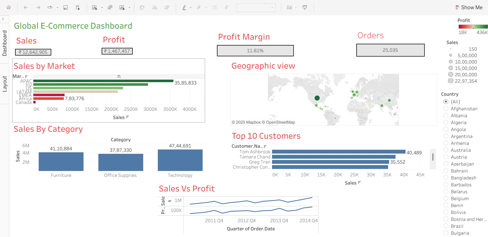

# Global E-Commerce Dashboard (Tableau)

## Project Overview
The Global E-Commerce Dashboard is an interactive Tableau visualization designed to analyze and monitor the performance of a multinational retail business.  
It helps stakeholders understand key sales trends, profitability, and regional performance to make informed business decisions.

This project uses the Superstore dataset (a well-known sample e-commerce dataset) to demonstrate data analytics and visualization best practices.

---

## Objective
The main purpose of this project is to:
- Provide data-driven insights into global e-commerce performance.
- Identify top-performing regions, products, and categories.
- Visualize sales, profit, and order trends across different time frames.
- Assist management in strategic planning and decision-making through interactive dashboards.

---

## Key Features
- **Sales and Profit Analysis:** Track total sales, profit, and quantity by country, region, and category.  
- **Performance KPIs:** View metrics such as profit ratio, discount effect, and shipping cost trends.  
- **Category Insights:** Compare how different product categories perform across locations.  
- **Interactive Filters:** Dynamically explore data by region, category, and time period.  
- **User-Friendly Dashboard:** Clean and professional Tableau interface for easy exploration.

---

## Tools and Technologies
- Tableau Desktop 2025.2  
- Superstore Dataset (CSV)  
- Data Visualization and Analytics  
- Calculated Fields and Parameters  

---

## Project Files
- `Global E-Commerce.twbx` – Packaged Tableau workbook containing all dashboards and data.  
- `Final Dashboard.twb` – Extracted Tableau workbook file.  
- `superstore.csv` – Source dataset used for analysis.

---

## Insights Gained
- Highest sales are observed in the United States, followed by India and Germany.  
- Technology and Office Supplies categories maintain consistent profit margins.  
- Regions with higher discounts tend to have lower profit ratios, indicating the cost of heavy discounting.  
- Seasonal trends show a spike in sales during Q4, revealing strong year-end demand.

---

## How to Use
1. Open the `Global E-Commerce.twbx` file in Tableau Desktop (version 2020.1 or later).  
2. Navigate through different dashboards using the tabs at the bottom.  
3. Use filters and dropdowns to explore insights by country, category, and time period.

---

## Future Enhancements
- Integration with live or real-time data sources (e.g., SQL Server, Snowflake).  
- Addition of forecasting and predictive analytics using Tableau extensions.  
- Inclusion of customer segmentation and profitability dashboards.

---

## Author
**Meenakshi A.**  
Data Visualization and Analytics Enthusiast  
meenakshi.ancha@gmail.com

---

## Conclusion
This Tableau project demonstrates how data visualization can transform raw data into actionable insights.  
It showcases the application of business intelligence in global e-commerce, helping identify trends, monitor KPIs, and uncover opportunities for growth.

---

## Dashboard Preview
You can insert your dashboard image below once uploaded (for example, a screenshot of your Tableau dashboard).

```markdown



